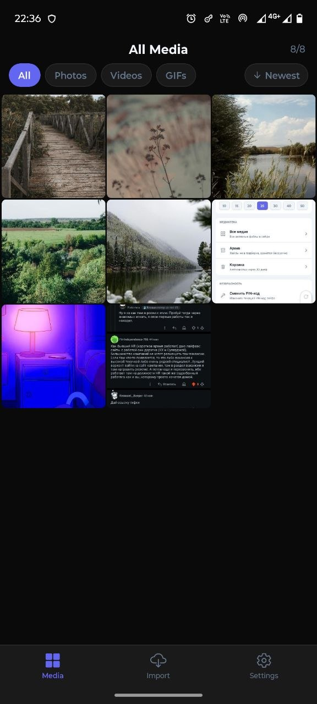
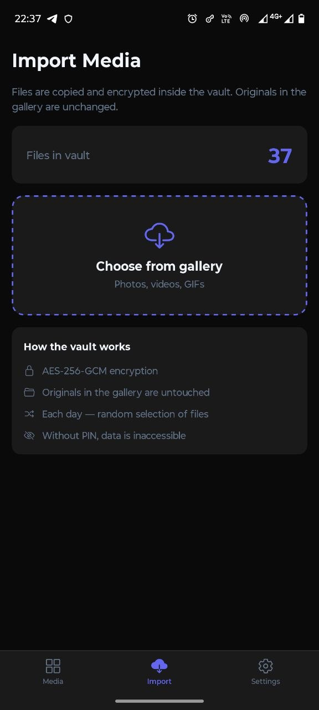
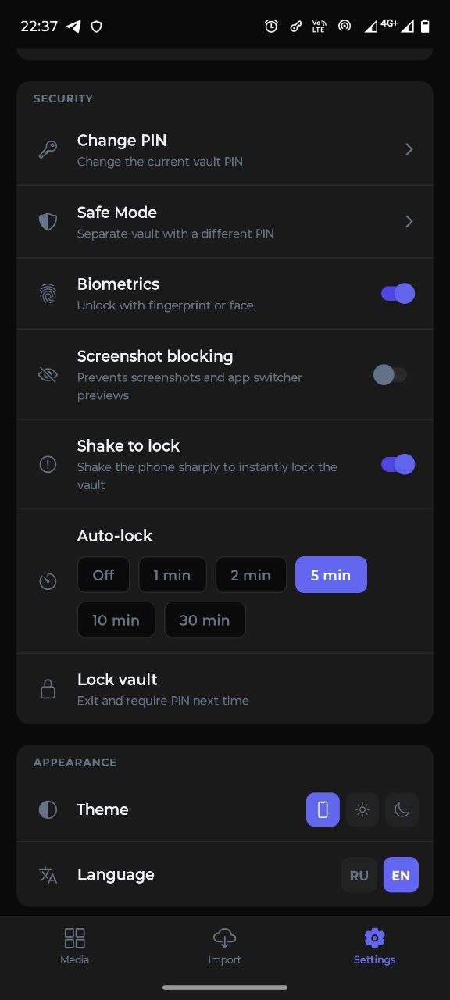

# Protected Gallery

A personal encrypted media vault for Android. Stores photos, videos and GIFs locally on-device — fully offline, protected by PIN, optionally by biometrics.

> Built for personal use. The code is functional and the architecture is straightforward — it does its job well.

<p align="center">
  
  &nbsp;&nbsp;
  
  &nbsp;&nbsp;
  
</p>
<p align="center">
  <sub>All Media &nbsp;·&nbsp; Import &nbsp;·&nbsp; Settings</sub>
</p>

## Features

- AES-256-GCM encryption — every file encrypted individually before being written to disk
- Keys stored in Android Keystore — never exposed to JS
- PIN-code protected with brute-force counter
- Optional biometric unlock (fingerprint / face) — hidden button, no visible hint, off by default (tap the lower-left corner)
- Safe Mode — a second independent vault opened with a different PIN
- Daily randomizer tab — shows a random subset of your media each day (toggleable; shows all media when off)
- Full media viewer with pinch-to-zoom, horizontal swipe between files, swipe-down to dismiss
- Auto-hiding viewer controls — fade out after 2.5 s, tap to toggle; always visible for video
- Trash with 30-day auto-purge
- Archive for files you want to keep but not see daily
- Filter by type (photo / video / GIF) and sort in All Media
- Import from gallery with encrypted thumbnail generation
- Receive files via Android share sheet (ACTION_SEND / ACTION_SEND_MULTIPLE)
- Export — temporary decrypted copy shared via system share
- Auto-lock after N minutes of inactivity
- Shake-to-lock panic gesture (toggleable)
- `FLAG_SECURE` — blocks screenshots and app switcher previews at OS level (toggleable)
- Russian / English UI — auto-detected from device locale (CIS → Russian, others → English), switchable in Settings
- Light / Dark / System theme
- Fully offline — zero network requests

## Stack

| Layer | Library |
|---|---|
| Framework | React Native 0.81.5 + Expo SDK 54 |
| Native project | expo-dev-client (bare workflow, `android/` present) |
| Encryption | `@noble/ciphers` (AES-256-GCM) + `@noble/hashes` (PBKDF2) |
| Key storage | Android Keystore via `expo-secure-store` |
| Biometrics | `expo-local-authentication` |
| File system | `expo-file-system` (new `File` / `Directory` API) |
| Image display | `expo-image` |
| Video playback | `expo-video` |
| Shake detection | `expo-sensors` (Accelerometer) |
| Export | `expo-sharing` |
| Gallery access | `expo-media-library` |
| Settings | `@react-native-async-storage/async-storage` |
| Safe area | `react-native-safe-area-context` |
| i18n | Custom (no external deps) — `Intl.DateTimeFormat` locale detection |

## Security model

- Master key generated once, stored encrypted in Android Keystore
- Sub-keys derived per purpose (metadata store, file encryption) via PBKDF2
- Safe Mode uses a completely separate master key and namespace (`vault_safe/`)
- PIN is verified by attempting decryption — no plain PIN stored anywhere
- `FLAG_SECURE` is set in `MainActivity.kt` at startup; can be disabled per-user in Settings
- Biometric button is intentionally invisible — its position is known only to the owner

## Build

### Debug (with Metro, for development)

```bash
npx expo run:android
```

### Release (standalone APK, no Metro)

```bash
cd android
./gradlew assembleRelease
adb install -r app/build/outputs/apk/release/app-release.apk
```

The release APK is signed with the debug keystore by default (`signingConfig signingConfigs.debug` in `build.gradle`). For distribution swap in a proper keystore.

### Requirements

- Android 10+ (API 29+)
- `adb` in PATH
- JDK 17+
- New Architecture enabled (`newArchEnabled=true`)

## Project structure

```
src/
  crypto/       PIN hashing, master key generation, sub-key derivation
  storage/      Metadata store (encrypted JSONL), vault file I/O, settings
  screens/      PinSetup, PinEntry, Daily, Import, Viewer, Settings,
                AllMedia, Trash, Archive, SafeModeSetup, ChangePin
  components/   TabBar, MediaThumbnail, ZoomableImage, PinPad, SelectionBar
  hooks/        useSelection
  context/      ThemeContext
  i18n/         en.ts, ru.ts, index.ts — locale detection + runtime switching
  utils/        media helpers (formatDuration, formatFileSize, …)
  types/        shared TypeScript types
android/        native Android project (Kotlin, Gradle)
```

## Android native additions

Three things added to the default Expo template:

1. **`FLAG_SECURE`** set in `MainActivity.kt` `onCreate` — blocks screenshots at the OS window level
2. **Share intent handling** — `processShareIntent()` + `onNewIntent()` in `MainActivity.kt` receives files from the system share sheet, copies them to `cacheDir/pending_share/`, JS picks them up on next foreground
3. **`SecureFlagModule.kt`** — native Kotlin module that lets JS toggle `FLAG_SECURE` at runtime (used by the screenshot-blocking toggle in Settings)

## License

MIT
